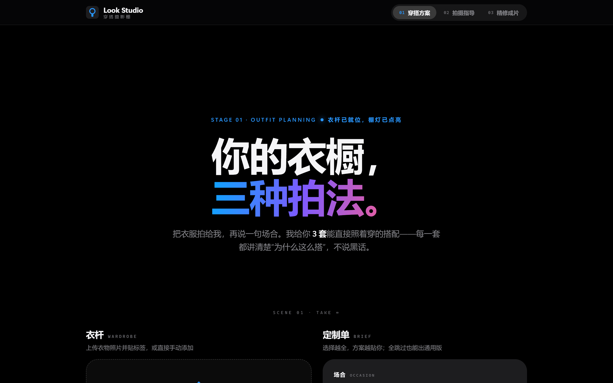
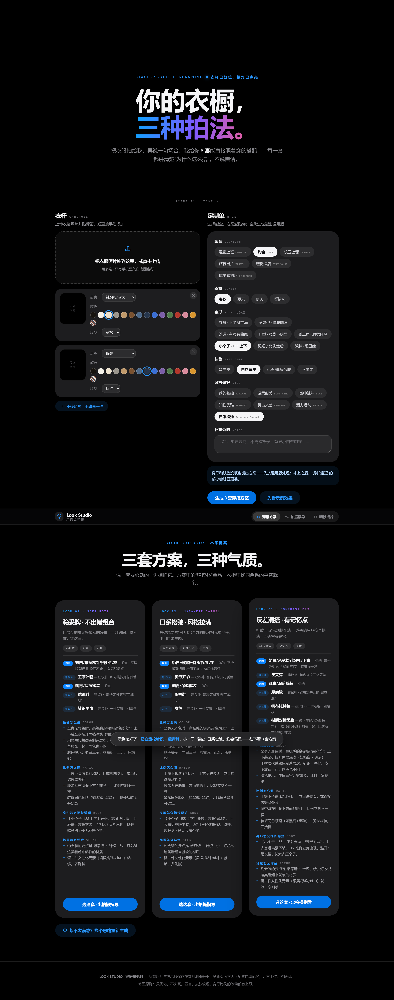
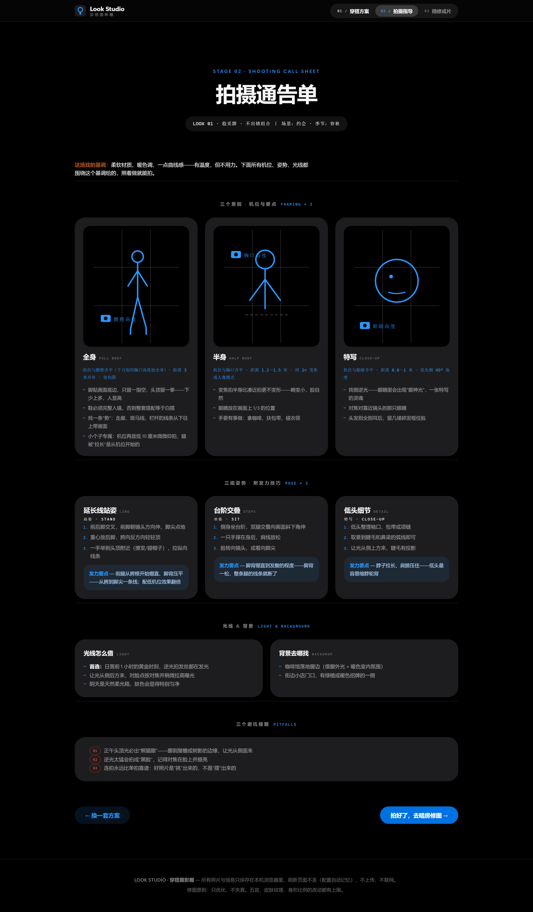
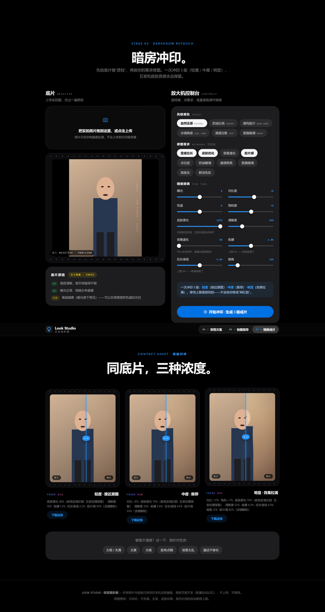

# LOOK STUDIO · 穿搭摄影棚

> 把「AI 穿搭摄影专家」装进一个桌面 App：**穿搭方案 → 拍摄指导 → 暗房精修**，一条龙走完。
> 照片与数据**全程留在本地**，不上传、不联网。



## 这是什么

一个 Windows 桌面应用（Electron 打包），把一套完整的穿搭摄影工作流装进三个阶段：

### 01 穿搭方案
- 上传衣物照片并贴标签（品类 / 颜色 / 版型 / 材质），或手动输入文字自动识别
- 选择场合、季节、身形、肤色、风格偏好（信息不全也能出通用方案）
- 一次生成 **3 套差异化搭配**，每套标注「你的 / 建议补」单品，讲清四层逻辑：**色彩 / 比例 / 材质 / 身形扬长避短 / 场景**



### 02 拍摄通告单
- 3 个景别（全身 / 半身 / 特写）的机位角度与要点，**带机位示意图**
- 3 组姿势（站 / 坐 / 特写），每步都标注**发力技巧**（如「下巴前伸 1 厘米再微收——消双下巴」）
- 场景化的光线借法、背景推荐、3 个避坑提醒
- 小个子等身形会自动切换专属机位与姿势（如「延长线站姿」+ 低机位）



### 03 暗房精修
- 先给照片做**质检**：模糊度（拉普拉斯方差）、过曝/欠曝、高光溢出、色温偏移、分辨率——太差会给出重拍建议
- 按需求修图：**一次冲印 3 版**（轻度 / 中度 / 明显），每版附修图说明
- 修图引擎（纯浏览器 Canvas，无 AI 上传）：
  - 皮肤柔化：YCbCr 肤色区域识别 + 边缘保护，**五官与皮肤纹理保留**
  - 身线调整：切片重采样收腰/拉长，**幅度硬上限 6% / 8%**，拒绝失真
  - 氛围虚化：中心主体椭圆保护；胶片调色：S 曲线 + 提黑 + 细颗粒
- 成片支持**原片/修后拖动对比**，单张下载



## 谁能用 / 怎么用

**电脑（Windows）**：去 [Releases](../../releases) 下载 `LookStudio-win32-x64.zip`，解压后双击 **Look Studio.exe** 即可。

- 无需安装、无需管理员权限、不写注册表
- 所有照片与配置只保存在本机，配置自动记忆（localStorage）

**手机（iPhone / 安卓）**：浏览器打开 **https://724-star.github.io/look-studio/**

1. iPhone（Safari）：分享 → 添加到主屏幕
2. 安卓（Chrome）：菜单 → 添加到主屏幕 / 安装应用
3. 桌面出现独立图标，全屏运行；首次打开后**离线也能用**（PWA）

## 从源码运行

```bash
npm install        # 国内建议先：$env:ELECTRON_MIRROR="https://npmmirror.com/mirrors/electron/"
npm start          # 开发模式
npm run dist       # 打包 Windows 绿色版到 dist/
```

## 技术说明

- 纯前端实现（HTML/CSS/JS），无后端、无外部 API、零遥测
- 穿搭与拍摄知识来自内置规则引擎（色彩策略 / 身形规则库 / 场景模板 / 材质策略），**完全离线**
- 图像处理为经典算法（盒式模糊、USM 锐化、区域重采样），刻意**不使用生成式 AI**——修图底线是「只优化，不失真」
- 界面为 Apple Keynote 风格：纯黑舞台、渐变标题、毛玻璃导航、逐段浮现动效（尊重系统「减少动态效果」设置）

## 测试

```bash
python test_flow.py            # 全流程回归（Playwright 无头浏览器）
python test_interactions.py    # 交互细节回归（拖动对比线 / 微调按钮 / 配置记忆）
```

## License

[MIT](LICENSE)
